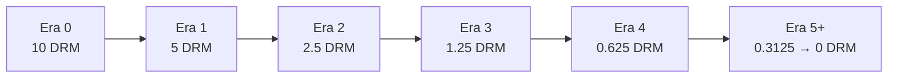

# DRACHMA Token Economics

A concise overview of supply, issuance, and fair-launch mechanics for the DRACHMA blockchain.

## Supply Overview
- **Ticker:** DRM
- **Total Supply Cap:** 42,000,000 DRM
- **Circulating Supply at Launch:** 0 DRM (all issuance via on-chain mining)

## Issuance Model
- **Consensus Layer:** Layer 1 proof-of-work minting through block rewards.
- **Starting Block Reward:** 10 DRM per block.
- **Halving Interval:** Every 2,102,400 blocks (~4 years at 60s block time).
- **Emission Curve:** Geometric halving until block rewards asymptotically approach zero, converging to the 42M cap.

| Era | Block Range (inclusive) | Reward per Block (DRM) | Era Emission (DRM) | Cumulative Supply (DRM) |
| --- | ----------------------- | ---------------------- | ------------------- | ----------------------- |
| 0 | 0 – 2,102,399 | 10.00000000 | 21,024,000 | 21,024,000 |
| 1 | 2,102,400 – 4,204,799 | 5.00000000 | 10,512,000 | 31,536,000 |
| 2 | 4,204,800 – 6,307,199 | 2.50000000 | 5,256,000 | 36,792,000 |
| 3 | 6,307,200 – 8,409,599 | 1.25000000 | 2,628,000 | 39,420,000 |
| 4 | 8,409,600 – 10,511,999 | 0.62500000 | 1,314,000 | 40,734,000 |
| 5+ | 10,512,000 onward | 0.31250000 → 0 over time | ~1,266,000 (long tail) | 42,000,000 cap |

**Halving math:** subsidy at height `h` is `floor(10 DRM * 1e8 / 2^(h // 2,102,400)) / 1e8` with consensus range checks to prevent overflow.

### Emission Curve (Mermaid)

## Fair Launch Commitments
- **Genesis Block:** Contains only protocol setup transactions; no premine or founder allocations.
- **Miner Access:** Open-source clients and miner reference implementations released ahead of launch to ensure open participation.
- **Faucet on Testnet:** Test assets available solely for development; no testnet balances migrate to mainnet.
- **Transparency:** Public release of genesis block configuration, block reward schedule, and audit reports prior to mainnet activation.

## Distribution Integrity
- Block rewards are the sole issuance mechanism; there are no stealth mints, developer rewards, or advisor grants embedded in the protocol.
- Difficulty adjustment and validation rules are enforced at launch to prevent timestamp or reward manipulation.
- Wallets and explorers will clearly display circulating supply and remaining issuance to maintain user trust.
- The mandatory merge-mined WASM sidechain does not expand total supply; NFT execution uses fixed gas without TLN coupling, DRM funds contracts, and OBL funds dApps. No wrapped assets are minted.
