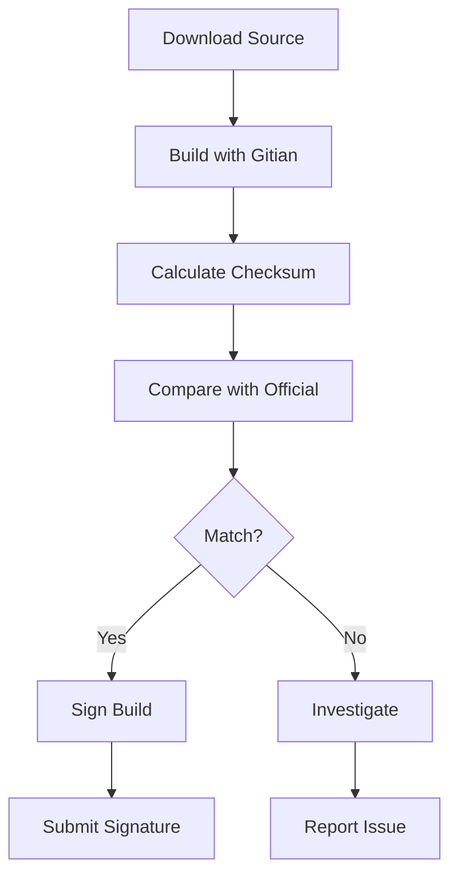

# PARTHENON CHAIN Gitian Builds - Complete Guide

**Version:** 2.0  
**Last Updated:** January 10, 2026  
**Status:** Production Ready

## Overview

This guide provides complete instructions for setting up and running Gitian builds for PARTHENON CHAIN. Gitian builds ensure that binaries built by different people produce bit-for-bit identical results, enabling independent verification of releases.

## Why Gitian Matters

**Security First:** Prevents compromised build environments from injecting malicious code into binaries.

**Community Verification:** Multiple independent builders can verify that releases match the source code exactly.

**Trust Through Transparency:** The entire build process is documented, deterministic, and reproducible.

## Quick Start

```bash
# 1. Run the setup script (installs Gitian and creates base VM)
./scripts/gitian-setup.sh

# 2. Build for Linux
cd ~/gitian-builder
export VERSION=v0.1.0
./bin/gbuild --commit parthenon-chain=${VERSION} \
    ../PARTHENON-CHAIN/contrib/gitian-descriptors/gitian-linux.yml

# 3. Sign your build (optional, requires GPG key)
./bin/gsign --signer "Your Name <email@example.com>" \
    --release ${VERSION}-linux \
    ../PARTHENON-CHAIN/contrib/gitian-descriptors/gitian-linux.yml
```

## System Requirements

### Minimum Requirements
- **OS:** Linux (Ubuntu 20.04+ or Debian 11+ recommended)
- **RAM:** 4 GB minimum, 8 GB recommended
- **Disk:** 20 GB free space for base VM and builds
- **CPU:** Virtualization support (KVM or VirtualBox)

### Required Software

```bash
# Ubuntu/Debian
sudo apt-get update
sudo apt-get install -y \
    git \
    ruby \
    apt-cacher-ng \
    qemu-utils \
    debootstrap \
    lxc \
    python3-cheetah \
    parted \
    kpartx \
    bridge-utils \
    make \
    ubuntu-archive-keyring \
    curl \
    firewalld \
    apparmor
```

## Detailed Setup

### Step 1: Automated Setup (Recommended)

```bash
cd PARTHENON-CHAIN
./scripts/gitian-setup.sh
```

This script will:
1. Check system requirements
2. Clone Gitian Builder to `~/gitian-builder`
3. Create Ubuntu Focal base VM (`base-focal-amd64.tar.gz`)
4. Set up directory structure

**Time:** 10-20 minutes (mostly base VM creation)

### Step 2: Manual Setup (Alternative)

If you prefer manual setup:

```bash
# Clone Gitian Builder
git clone https://github.com/devrandom/gitian-builder.git
cd gitian-builder

# Make scripts executable
chmod +x bin/*

# Create base VM
bin/make-base-vm --suite focal --arch amd64

# This creates base-focal-amd64.tar.gz (~500MB)
```

## Building Binaries

### Linux Build (Primary Platform)

```bash
cd ~/gitian-builder

# Set version to build
export VERSION=v0.1.0

# Build
./bin/gbuild \
    --commit parthenon-chain=${VERSION} \
    ../PARTHENON-CHAIN/contrib/gitian-descriptors/gitian-linux.yml

# Results will be in build/out/
ls -lh build/out/parthenon-core-*.tar.gz
```

**Build time:** 20-40 minutes depending on hardware

### Windows Build (Cross-compilation)

**Note:** Windows builds require additional setup for MinGW cross-compilation toolchain.

```bash
# Download Windows dependencies first
# (This step requires preparation - see Advanced section)

./bin/gbuild \
    --commit parthenon-chain=${VERSION} \
    ../PARTHENON-CHAIN/contrib/gitian-descriptors/gitian-win.yml
```

### macOS Build (Requires SDK)

**Note:** macOS builds require the macOS SDK which can only be obtained from Xcode (Apple Developer account required). For most users, macOS builds are done via GitHub Actions CI.

```bash
# Requires MacOSX11.0.sdk.tar.gz in inputs/
./bin/gbuild \
    --commit parthenon-chain=${VERSION} \
    ../PARTHENON-CHAIN/contrib/gitian-descriptors/gitian-osx.yml
```

## Verifying Builds

### Check Build Output

```bash
# View build log
cat ~/gitian-builder/var/build.log

# List produced artifacts
ls -lh ~/gitian-builder/build/out/

# Calculate checksums
sha256sum ~/gitian-builder/build/out/parthenon-core-*.tar.gz
```

### Compare with Official Release

```bash
# Download official release
wget https://github.com/Tsoympet/PARTHENON-CHAIN/releases/download/v0.1.0/parthenon-core-v0.1.0-linux-x86_64.tar.gz

# Download official checksum
wget https://github.com/Tsoympet/PARTHENON-CHAIN/releases/download/v0.1.0/parthenon-core-v0.1.0-linux-x86_64.tar.gz.sha256

# Compare
sha256sum parthenon-core-v0.1.0-linux-x86_64.tar.gz
cat parthenon-core-v0.1.0-linux-x86_64.tar.gz.sha256
```

**If checksums match:** Build is verified as reproducible! ✅

## Signing Builds

### Why Sign?

Signing builds helps the community verify that multiple independent builders produced identical binaries.

### Generate GPG Key (First Time Only)

```bash
# Generate key
gpg --full-generate-key

# Select:
# - RSA and RSA
# - 4096 bits
# - Enter your real name and email
# - Set a strong passphrase

# Verify key created
gpg --list-keys
```

### Sign Your Build

```bash
cd ~/gitian-builder

./bin/gsign \
    --signer "Your Name <your@email.com>" \
    --release ${VERSION}-linux \
    ../PARTHENON-CHAIN/contrib/gitian-descriptors/gitian-linux.yml
```

### Submit Signature (For Trusted Builders)

```bash
# Fork and clone gitian.sigs repository
git clone https://github.com/parthenon-chain/gitian.sigs.git
cd gitian.sigs

# Create directory for your signatures
mkdir -p ${VERSION}-linux/yourname

# Copy signature
cp ~/gitian-builder/sigs/${VERSION}-linux/yourname/* ${VERSION}-linux/yourname/

# Commit and submit PR
git add .
git commit -m "Add ${VERSION}-linux signatures for yourname"
git push origin master

# Create pull request on GitHub
```

## Advanced Topics

### Using LXC Instead of KVM

LXC is lighter weight than KVM but may have compatibility issues on some systems.

```bash
# Install LXC
sudo apt-get install lxc

# Build with LXC
./bin/gbuild --lxc \
    --commit parthenon-chain=${VERSION} \
    ../PARTHENON-CHAIN/contrib/gitian-descriptors/gitian-linux.yml
```

### Parallel Builds

```bash
# Use multiple CPU cores
./bin/gbuild -j$(nproc) \
    --commit parthenon-chain=${VERSION} \
    ../PARTHENON-CHAIN/contrib/gitian-descriptors/gitian-linux.yml
```

### Caching Dependencies

Speed up subsequent builds by caching dependencies:

```bash
# Enable caching
export USE_VENV=1
export GITIAN_CACHE_DIR=~/gitian-cache
mkdir -p $GITIAN_CACHE_DIR

# Builds will now cache and reuse dependencies
```

### Building Multiple Versions

```bash
# Build multiple versions in sequence
for VERSION in v0.1.0 v0.2.0 v0.3.0; do
    echo "Building ${VERSION}..."
    ./bin/gbuild --commit parthenon-chain=${VERSION} \
        ../PARTHENON-CHAIN/contrib/gitian-descriptors/gitian-linux.yml
    
    # Move artifacts
    mkdir -p ~/releases/${VERSION}
    cp build/out/* ~/releases/${VERSION}/
done
```

## Troubleshooting

### "command not found: gbuild"

Ensure you're in the `gitian-builder` directory and scripts are executable:

```bash
cd ~/gitian-builder
chmod +x bin/*
```

### Build Fails with Dependency Errors

Install all required build dependencies:

```bash
sudo apt-get install -y \
    cmake \
    ninja-build \
    libssl-dev \
    libboost-all-dev \
    libleveldb-dev
```

### "No base image found"

Create the base VM:

```bash
cd ~/gitian-builder
bin/make-base-vm --suite focal --arch amd64
```

### Out of Disk Space

Gitian builds can use 10-20 GB. Check available space:

```bash
df -h ~
```

Clean old builds:

```bash
rm -rf ~/gitian-builder/build
```

### Build is Not Reproducible

Ensure you're using the exact same:
- Version tag/commit
- Gitian descriptor file
- Base VM (Ubuntu Focal)
- Build environment

### Permission Errors

Ensure your user has proper permissions:

```bash
# Add user to necessary groups
sudo usermod -aG kvm,lxd $USER

# Re-login for changes to take effect
```

## Best Practices

1. **Use Fresh Environment**
   - Build in clean VM or container
   - Avoid running other processes during build

2. **Verify Descriptor Files**
   - Review `contrib/gitian-descriptors/*.yml` before building
   - Ensure they match community consensus

3. **Document Your Build**
   - Record: OS version, Gitian version, date
   - Note any modifications or issues encountered

4. **Compare Multiple Sources**
   - Don't trust a single build
   - Verify against official releases and other builders

5. **Keep Base VM Updated**
   - Periodically rebuild base VM for security updates
   - Use same base VM version as other builders

## Community Verification

### Becoming a Trusted Signer

1. Successfully build multiple releases
2. Verify your builds match official releases
3. Submit signatures to gitian.sigs repository
4. Participate in release verification discussions
5. Build reputation over time

### Verification Workflow



## Security Considerations

**Chain of Trust:**
1. Verify Git tag signature
2. Build in isolated environment
3. Compare with multiple independent builders
4. Sign only if builds match

**Never:**
- Build on compromised systems
- Share private keys
- Sign builds you didn't build yourself
- Trust single-source verification

## Performance Metrics

Typical build times on standard hardware:

| Platform | Time | Disk Space |
|----------|------|------------|
| Linux x86_64 | 20-40 min | 2-3 GB |
| Windows x86_64 | 40-60 min | 3-4 GB |
| macOS | 30-50 min | 3-4 GB |

## Resources

- **Gitian Builder:** https://github.com/devrandom/gitian-builder
- **Bitcoin's Guide:** https://github.com/bitcoin-core/docs/blob/master/gitian-building.md
- **Reproducible Builds:** https://reproducible-builds.org/
- **PARTHENON Docs:** https://github.com/Tsoympet/PARTHENON-CHAIN/tree/main/doc

## Support

**Questions or Issues?**
- GitHub Issues: https://github.com/Tsoympet/PARTHENON-CHAIN/issues
- Discussions: https://github.com/Tsoympet/PARTHENON-CHAIN/discussions
- Security: security@drachma.org

## License

PARTHENON CHAIN is released under the MIT License.

---

**Remember:** Reproducible builds are a cornerstone of trustless cryptocurrency security. Take the time to verify, and encourage others to do the same!
