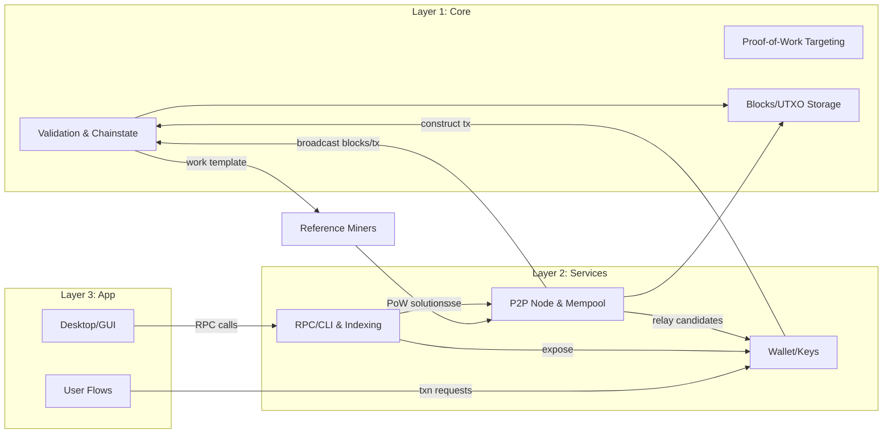

# DRACHMA Architecture

DRACHMA is organized into a strict three-layer stack to keep consensus-critical code minimal, isolate operational services, and allow the user interface to evolve independently. Each layer is versioned separately but communicates through stable, explicit interfaces.

## Layer Overview

- **Layer 1 – Core (Consensus Engine):** Implements deterministic validation and chainstate management. Responsibilities include block/transaction verification, UTXO set updates, PoW difficulty and target computation, and chain reorganization. Components live primarily under `layer1-core/` and `common/`.
- **Layer 2 – Services (Networking + Wallet):** Hosts all non-consensus daemons: P2P networking, mempool, fee policy, block/transaction relay, RPC/CLI, indexing, and wallet/key management. Source is under `layer2-services/` and may be restarted or upgraded without affecting consensus state.
- **Layer 3 – App (User Interface):** Desktop/GUI client and distribution packaging located in `layer3-app/`. It consumes RPC and wallet APIs; it never executes consensus rules directly.

## Interaction Diagram

## Responsibilities and Boundaries

### Layer 1: Core
- Deterministic validation of blocks and transactions, including script execution, sequence/locktime checks, and consensus-critical fees.
- Difficulty/target calculation and header validity (PoW, timestamps, versioning).
- Canonical chain selection, reorganizations, and snapshot handling.
- Persistent storage of blocks, headers, and UTXO set.
- **Never** manages network policy, wallet operations, or UI logic.

### Layer 2: Services
- P2P session management, peer discovery, inventory/compact block relay, bandwidth controls, and ban scores.
- Mempool admission (policy, ancestor/descendant tracking), fee estimation, and transaction rebroadcast.
- RPC/CLI endpoints for node control, wallet actions, mining work templates, and diagnostics.
- Wallet/key management: HD derivation, address formats, signing, and transaction assembly that references Layer 1 rules.
- Indexing for wallet balance lookup, block/transaction queries, and potential light client support.

### Layer 3: App
- GUI/desktop experience for end users, including node controls, wallet management, and miner configuration panels.
- Packaging, localization, and OS integration.
- Consumes only documented RPC and wallet APIs from Layer 2; can be replaced without consensus impact.

### Reference Miners
- Separate binaries under `miners/` implementing CPU and GPU work loops.
- Pull block templates and submit solved headers via Layer 2 RPC.
- Do not embed consensus logic beyond header assembly and nonce scanning.

## Data and Control Flows

1. Incoming blocks/transactions arrive via Layer 2 P2P, are validated by Layer 1, and then persisted.
2. Wallets in Layer 2 derive keys, assemble transactions using Layer 1 rules, and broadcast through the mempool.
3. Miners request templates from Layer 2, run PoW (CPU/GPU), and return solutions; Layer 1 validates before gossiping.
4. Layer 3 drives user actions (create transaction, start miner) solely through RPC, leaving consensus surfaces untouched.

## Mainnet Readiness Touchpoints

- Layer 1 parameters (subsidy, halving interval, difficulty clamps) are frozen in `technical-spec.md` and must not drift across releases.
- Layer 2 exposes RPC/auth surfaces; see `deployment.md` for hardening defaults and Prometheus endpoints.
- Layer 3 and miners are replaceable as long as they respect the documented RPC/block-template contracts.

## Upgrade Strategy

- **Consensus (Layer 1):** Any rule change requires explicit activation logic and broad review. Releases should be reproducible and signed.
- **Services (Layer 2):** Can iterate faster but must maintain compatibility with deployed Layer 1 rules. Backward-compatible RPC changes are preferred.
- **App (Layer 3):** UI features can ship independently as long as they honor stable RPC contracts.
- **Miners:** Follow the same template/RPC contracts; performance improvements should not alter consensus assumptions.
