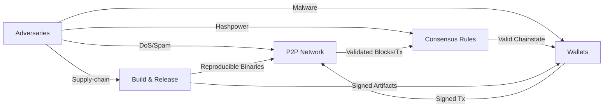

# Threat Model

## Overview
This model summarizes key assets, adversaries, and mitigations for DRACHMA across all layers. It is intended to guide auditors, contributors, and operators toward the highest-value security reviews.

## Assets
| Asset | Description |
| --- | --- |
| Chain integrity | Correct canonical chain, block headers, and UTXO set respecting monetary policy |
| User funds | On-chain balances secured by private keys and transaction validity rules |
| Private keys & mnemonics | Wallet seeds, passphrases, and signing keys stored locally |
| Network availability | P2P connectivity for block/transaction relay, RPC availability for operators |
| Build pipeline | Reproducible releases, dependency integrity, and signer keys |

## Adversaries
| Adversary | Capabilities | Goals |
| --- | --- | --- |
| 51% attacker | Majority hash power, eclipse attempts, chain withholding | Double-spend, censorship, inflation via invalid blocks |
| Malicious peers | Protocol abuse, malformed messages, resource exhaustion | DoS nodes, partition network, corrupt mempool/addrman |
| Wallet thieves | Local malware, clipboard hijacking, keylogging, memory scraping | Exfiltrate keys/mnemonics, forge transactions |
| Service abusers | RPC brute force, API misuse, spam transactions | Degrade availability, raise costs, exploit misconfigurations |
| Supply-chain attacker | Dependency compromise, build tampering, malicious binaries | Ship backdoored releases, bypass validation |

## Mitigations
| Threat | Mitigations |
| --- | --- |
| Deep reorgs / double-spend | Proof-of-Work with stable difficulty retargeting; full validation of every block/tx; alerts for abnormal reorg depth |
| Malformed or spam traffic | Bounded P2P message sizes, inventory limits, mempool fees, DoS scoring/ban logic, authenticated RPC |
| Key theft | Encrypted wallet storage, passphrase prompts in UI, optional air-gapped backups, mnemonic display guards |
| Node partition / eclipse | Multiple outbound connections, DNS/IP seeds diversity, manual `addnode` support, discouraging long-lived inbound-only peers |
| Build tampering | Reproducible CMake builds, signed release tags and artifacts, SBOM publication |

## Interaction Diagram

## Residual Risks
- Majority hash power can still censor or reorder transactions temporarily.
- Users on untrusted networks can be eclipsed if connections are constrained; diversify peers.
- Endpoint compromise defeats local wallet protections; encourage offline backups and hardened hosts.

## Operational Guidance
- Run multiple nodes with diverse peers and monitor for unexpected reorg depth or peer churn.
- Use strong passphrases and offline backups for wallets; consider hardware isolation where available.
- Verify signatures and hashes for every release; prefer building from source with pinned dependencies.
- Enable logging and alerting for RPC authentication failures and abnormal resource usage.
